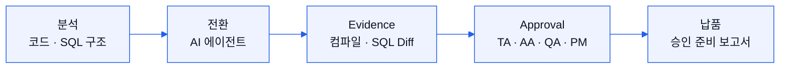

# Klaro Forge는 어떻게 작동하나

Forge는 코드 생성기가 아니라 AI 산출물의 납품을 통제하는 곳입니다. 레거시 전환을 에이전트가 수행하고, 반영 전에 검토·테스트·승인 기록을 남깁니다.

## "컴파일 성공"으로 끝내지 않는다

Evidence 엔진이 컴파일과 정적 점검, SQL Diff, 기준 입출력 비교를 설명 가능한 근거로 묶습니다. 빌드가 통과했다는 사실만으로는 정확성을 보장하지 못하기 때문입니다.

## 승인 리스크를 구조로 줄인다

TA·AA·QA·PM의 승인 이력을 산출물과 함께 남깁니다. 규제 산업의 구매 조건인 "누가 어떤 근거로 승인했는가"에 답하기 위해서입니다.

## 사람은 결정, AI는 수행

에이전트의 실행 범위를 두 축으로 정합니다. 자율성(supervised · bounded · autonomous)과 검토 정책(always · risk_based · evidence_gated)입니다. 변경 요청 피드백은 이전 출력을 덮어쓰지 않고 이어 붙입니다(append-only). 수동 작업도 같은 승인 게이트를 지나므로, 원장과 승인 흐름이 한결같습니다.

## LLM을 직접 부르지 않는다

Forge 본체는 모델을 직접 호출하지 않고 에이전트 런타임에 위임합니다. 계획·실행·검증을 구조화된 계약 위에서 돌리고, 모델은 교체 가능한 부품으로 둡니다.

## 실제 규모로 검증한다

C·ECPG 기간계 레거시 전환 픽스처를 직접 구축해 씁니다. 온라인 서비스와 배치를 합쳐 2,000본이 넘고, 매입→대사→정산→원장으로 이어지는 다단계 트랜잭션 체인까지 포함합니다. 소스는 고객 환경 밖으로 나가지 않는 구조로 실행합니다.
